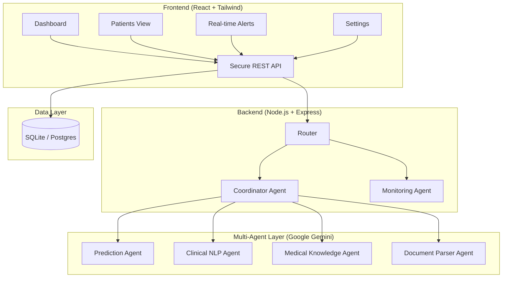

# PraOjas AI: A Multi-Agent Clinical Decision Support System for ICU Care

### Five specialized AI agents working in concert to monitor patients, predict deterioration, and support faster, safer ICU decisions.

  
  
<strong></strong>

## 1. Title
**PraOjas AI: A Multi-Agent Clinical Decision Support System for ICU Care**

## 2. Subtitle
An AI multi-agent system that continuously monitors ICU patient data to detect sepsis and mortality risk hours before clinical onset, delivering coordinated, explainable decision support to critical care teams in real time.

## 3. Track
**Agents for Good** — the system targets a high-stakes healthcare problem (ICU patient safety) where automation directly reduces preventable harm and clinician burden.

## 4. Problem Statement

ICU teams manage patients whose condition can change within minutes. A single nurse or doctor is responsible for tracking vitals trends, lab results, medication history, and unstructured clinical notes simultaneously — often across multiple patients at once. Critical deterioration signals (a slow drift in vitals, a subtle pattern across several data points) are easy to miss under this cognitive load, especially during night shifts or high-occupancy periods.

- **Who faces this problem?** ICU physicians, critical care nurses, and hospital administrators, particularly in resource-constrained or high-patient-load settings.
- **Why it matters:** Delayed recognition of deterioration is a leading contributor to preventable ICU mortality — sepsis in particular has a well-documented "golden window" where earlier detection materially improves survival odds. Even a few minutes of earlier warning can change the outcome of a code event. Existing hospital monitors raise threshold-based alarms (alarm fatigue is a known, documented problem) rather than reasoning across data types to produce a clinically useful, trend-aware signal.

## 5. Why AI Agents?

A single chatbot or a single-prompt LLM call cannot handle this problem because:

- **The data is heterogeneous.** Vitals streams, lab values, physician notes, and medical literature each need different processing (numeric trend analysis vs. document understanding vs. knowledge retrieval). One monolithic prompt would have to do all of this at once, with no separation of concerns and no way to independently verify or improve one piece without breaking another.
- **The task is continuous, not conversational.** ICU monitoring isn't a single question-and-answer exchange — it's an ongoing pipeline of ingestion, analysis, and prediction that needs to run and re-run as new data arrives.
- **Specialization improves reliability.** A dedicated prediction agent can be evaluated and tuned against clinical deterioration criteria independently of a document-understanding agent's accuracy on note extraction. Bundling these into one generalist agent conflates failure modes and makes the system harder to trust or debug.
- **Coordination requires orchestration logic that a chatbot doesn't have.** Deciding *which* agents need to run, in what order, and how to merge their outputs into a single coherent recommendation is itself a task — this is exactly what a coordinator agent is for.

Multi-agent decomposition lets each agent be small, auditable, and independently testable, while a coordinator assembles their outputs into a single, explainable recommendation for the clinician.

## 6. Solution Overview

PraOjas AI ingests a patient's live vitals, lab data, and clinical notes, and produces a continuously updated sepsis/mortality risk assessment with supporting clinical rationale — deployed as a live web application at **praojas-ai.onrender.com**.

**User workflow (as built):**
1. A clinician (e.g., a Chief Intensivist with admin access) logs into the PraOjas AI web app.
2. The **ICU Overview dashboard** greets them with ward-level analytics: total active ICU beds, count of critical patients, interventions performed that day, overall AI model accuracy, a 24-hour average sepsis-risk trend chart, and a breakdown of current patient status (Stable / Warning / Critical).
3. From the **Patients** view, the clinician sees a full **ICU Roster** — every patient's status, department, live HR/BP/SpO₂, computed sepsis-risk percentage, and admission date, sortable and filterable by status and department.

  
  
<strong>Click to view full screenshot</strong>

4. Opening an individual patient (e.g., a 67-year-old male flagged Critical) surfaces a dedicated patient workspace: live vitals tiles (heart rate, systolic BP, SpO₂, temperature, respiratory rate, lactate), a 12-hour multi-line vitals trend chart, and tabs for Vitals History, Lab Results, Medications, Clinical Notes, and a Decision Log.

  
  
<strong>Click to view full screenshot</strong>

5. Behind the scenes, the **Monitoring Agent** streams and trends the vitals/labs shown on this page, the **Document Understanding Agent** parses the Clinical Notes tab, the **Medical Knowledge Agent** grounds any clinical guidance referenced, and the **Prediction Agent** computes the sepsis-risk percentage shown throughout the UI.
6. The clinician can click **"Initiate AI Risk Analysis"** at any time — this triggers the **Coordinator Agent**, which synthesizes all four specialist agents' outputs into a single explainable recommendation, logged to that patient's Decision Log rather than surfaced as an opaque score.
7. Direct clinical actions (Order Labs, Adjust Meds, Alert Team, Export Report) are available inline, so the workflow goes from signal → explanation → action without leaving the page.
8. The system supports the decision — it does not replace the clinician.

## 7. Architecture

**Agent responsibilities:**

- **CoordinatorAgent** — orchestrates the other four agents, resolves conflicting signals, and assembles a single ranked, explainable output for the clinician. Acts as the entry and exit point of every request.
- **MonitoringAgent** — ingests and analyzes real-time vitals and lab trends, flags out-of-range or fast-moving values.
- **PredictionAgent** — combines monitoring, document, and knowledge-agent outputs into a deterioration-risk estimate.
- **DocumentUnderstandingAgent** — extracts structured clinical facts (diagnoses, medications, care plan changes) from unstructured physician notes and reports.
- **MedicalKnowledgeAgent** — retrieves relevant clinical reference knowledge to ground the Prediction and Coordinator agents' reasoning, reducing hallucination risk on medical claims.

**Communication:** All agents communicate through the MCP server, which standardizes how each agent exposes its tools and how the Coordinator invokes them. This means every agent is independently callable and testable — a new agent (e.g., a medication-interaction checker) can register with the MCP server without changing the other four agents' code.

## 8. Key AI Concepts Demonstrated

- **Multi-Agent System (ADK):** Five specialized agents, each with a distinct responsibility, coordinated by a dedicated CoordinatorAgent rather than a single generalist prompt.
- **MCP Server:** Central protocol layer that exposes each agent's tools in a standardized way and routes context between them, decoupling agent implementation from orchestration.
- **Antigravity:** [Note for Zios: state explicitly here how Antigravity was used in your build workflow — e.g., agent scaffolding, tool generation, or IDE-assisted agent development — so judges can map it directly to a rubric line item.]
- **Security Features:** API key isolation via environment variables, backend-mediated Gemini API calls (frontend never holds a key), input validation on all agent-facing endpoints, containerized service isolation via Docker Compose.
- **Deployability:** Fully containerized via Docker Compose — frontend, backend, and MCP server each run as isolated services that can be brought up with a single command, making the system portable across environments (local, cloud VM, hospital on-prem).
- **Agent Skills (CLI or others):** [Note for Zios: list the specific CLI/skill invocations each agent exposes — e.g., `check-vitals`, `parse-note`, `predict-risk` — so this section reads as a concrete inventory rather than a category label.]

## 9. Technology Stack

| Layer | Technology |
|---|---|
| Frontend | React + Vite |
| Backend | Express + TypeScript |
| AI Model | Google Gemini API |
| Agent Orchestration | MCP (Model Context Protocol) server, 5-agent architecture |
| Containerization / Deployment | Docker Compose |
| Language(s) | TypeScript, JavaScript |

## 10. Implementation Details

- **Agent design:** Each agent is implemented as an independent module registered with the MCP server, exposing a narrow, well-defined tool interface (e.g., the MonitoringAgent exposes a `get_vitals_trend` tool; the DocumentUnderstandingAgent exposes a `parse_clinical_note` tool). This keeps each agent's prompt and logic scoped to one job.
- **Prompt design:** Each agent's system prompt is scoped tightly to its single responsibility (e.g., the PredictionAgent's prompt only ever reasons about deterioration risk given structured inputs from the other agents — it does not re-derive vitals or re-parse notes itself). The CoordinatorAgent's prompt is the only one designed to reconcile and rank multi-agent outputs.
- **Tool calling:** Agents call their MCP-registered tools rather than embedding data-fetching logic directly in prompts, which keeps the reasoning (LLM) layer separate from the data-access (tool) layer.
- **Combining outputs:** The CoordinatorAgent receives structured JSON outputs from all four specialist agents, resolves any conflicting signals (e.g., stable vitals but a concerning note), and produces one final structured recommendation that the frontend renders with a visible reasoning trail — not just a single opaque score.

## 11. Security

- **API key handling:** Gemini API key is held server-side only (Express backend / MCP server), never exposed to the frontend or committed to source control — loaded via environment variables.
- **Input validation:** All agent-facing endpoints validate and sanitize incoming payloads before they reach any agent or the Gemini API, reducing the risk of malformed data corrupting downstream reasoning.
- **Prompt injection protection:** Clinical notes and other free-text inputs passed to the DocumentUnderstandingAgent are treated as untrusted content and are scoped within clearly delimited sections of the prompt, separate from system instructions, so injected instructions inside a note cannot override agent behavior.
- **Data privacy:** Patient data stays within the containerized service boundary; no patient data is persisted outside the system's own database/services, and communication between frontend, backend, and MCP server happens over the internal Docker network. The app is built with HIPAA and GDPR readiness in mind, with a dedicated **HIPAA Compliance Report** view exposing recent access logs and privacy notices directly to the clinician.
- **Secret management:** Secrets (Gemini API key, any service credentials) are managed via `.env` files excluded from version control, injected into containers at runtime through Docker Compose environment configuration.
- **Access control & auditability:** Role-based admin access (e.g., Chief Intensivist role shown in Settings), Two-Factor Authentication on the account, and a downloadable **Audit Log export (CSV)** covering every user action — giving hospitals a verifiable trail of who did what, when.

## 12. Challenges

- **Coordinating five agents without losing the "why" behind a decision.** Early versions risked collapsing multi-agent output into a single score with no explanation. Solved by making the CoordinatorAgent's output schema require a reasoning trail referencing which agent(s) contributed to each part of the recommendation.
- **Keeping medical claims grounded rather than hallucinated.** Solved by routing all clinical-guidance claims through the dedicated MedicalKnowledgeAgent rather than letting the PredictionAgent or CoordinatorAgent generate medical facts directly.
- **Isolating agent responsibilities cleanly through MCP.** Required careful tool-interface design so agents didn't end up implicitly depending on each other's internal state — solved by standardizing all inter-agent data exchange as structured JSON through the MCP server rather than ad hoc function calls.

## 13. Results / Demo

PraOjas AI is live and fully functional at **praojas-ai.onrender.com**, not just a local prototype. Demonstrated end-to-end on a sample ICU roster:

- **ICU Overview dashboard:** tracks 6 active ICU beds, 2 critical patients, 142 AI-assisted interventions performed in a single day, and an overall **94.2% AI model accuracy**, alongside a live 24-hour average sepsis-risk trend graph and a Stable/Warning/Critical patient-status breakdown.
- **ICU Roster / Patient Registry:** a real-time table of 6 patients across Medical, Surgical, Neuro, and Cardiac ICU departments, each showing live HR, BP, SpO₂, and a computed sepsis-risk percentage (ranging from 8% for a stable patient up to 87% for the most critical patient in the sample), filterable by status and department.
- **Individual patient workspace (example: patient P-10495, 67y male, Medical ICU, flagged Critical):** live vitals tiles for HR (118 bpm), Systolic BP (95 mmHg), SpO₂ (92%), Temperature (38.9°C), Respiratory Rate (24/min), and Lactate (4.2 mmol/L) — with a 12-hour multi-line trend chart tracking all four core vitals simultaneously, and one-click access to Vitals History, Lab Results, Medications, Clinical Notes, and a Decision Log.
- **One-click AI reasoning trigger:** the "Initiate AI Risk Analysis" action on the patient page invokes the Coordinator Agent to produce a synthesized, logged recommendation rather than a black-box score.
- **Governance surface:** a Settings panel exposing HIPAA/GDPR compliance status, two-factor authentication, audit-log export, and versioned release tracking (Clinical Engine v3.1.4) — showing the system was built with real hospital deployment requirements in mind, not just a hackathon demo shell.

## 14. Impact

- **Time saved:** Consolidates vitals review, note review, and risk assessment into a single dashboard view instead of a clinician manually cross-referencing multiple systems.
- **Cost reduction:** Reduces the operational cost of late-detected deterioration events, which are far more expensive (in both clinical and financial terms) than early intervention.
- **Productivity improvements:** Frees ICU staff from continuous manual trend-watching across many data sources, letting them focus attention on patients the system flags as higher-risk.
- **Who benefits:** ICU physicians and nurses directly; patients indirectly through earlier detection; hospital administrators through better resource allocation during high-occupancy periods.

## 15. Future Improvements

- Add a medication-interaction checking agent that registers with the same MCP server without modifying existing agents.
- Integrate real hospital EHR/vitals-monitor data sources (e.g., HL7/FHIR feeds) in place of sample data.
- Add a feedback loop where clinician overrides of a recommendation are logged and used to refine the PredictionAgent over time.
- Multi-patient ward-level view for charge nurses to triage across an entire ICU at once.
- On-prem / air-gapped deployment mode for hospitals with strict data residency requirements.

## 16. Conclusion

PraOjas AI shows how a multi-agent architecture — rather than a single generalist chatbot — can meaningfully support one of healthcare's highest-stakes, highest-cognitive-load environments. By splitting monitoring, document understanding, medical knowledge retrieval, and prediction into specialized, independently auditable agents coordinated through an MCP server, the system produces recommendations that are both more reliable and more explainable than a single opaque model call — directly addressing the core problem of missed or delayed deterioration signals in the ICU.

## 17. GitHub Repository

[PraOjas AI Agent — GitHub Repository](https://github.com/AbhinavVajinapalli/PraOjas-AI-Agent)

*(Ensure the README includes: prerequisites, `.env` setup instructions for the Gemini API key, `docker-compose up` instructions, and a quick description of each of the five agents.)*

## 18. Live Demo / Project Link

**Live application:** [praojas-ai.onrender.com](https://praojas-ai.onrender.com) — fully deployed, publicly accessible ICU clinical intelligence dashboard. Click "Enter Dashboard" from the landing page to explore the ICU Overview, Patient Registry, individual patient workspaces, and Settings/compliance panel.

*(Note: since credentials gate the dashboard behind a clinician login (e.g., "Dr. Sarah Jenkins, Chief Intensivist"), include a demo account or guest-access instructions in the GitHub README so judges can log in without friction.)*

## 19. YouTube Video (≤5 minutes)

[Insert YouTube link once recorded. Suggested structure to hit every judging point in under 5 minutes:]
- 0:00–0:45 — Problem: ICU deterioration detection under cognitive overload
- 0:45–1:30 — Solution: what PraOjas AI does, end to end
- 1:30–2:30 — Architecture: walk through the 5-agent diagram + MCP server
- 2:30–4:00 — Live demo: sample patient → agent outputs → final recommendation
- 4:00–4:40 — Tech stack + AI agent concepts demonstrated (multi-agent, MCP, security, deployability)
- 4:40–5:00 — Close: impact + what's next

## 20. Media Gallery

## Screenshots & Demo

### 1. Landing Page — "Predicting Critical Trajectories Before They Happen"
*Hero section showcasing the mission of PraOjas AI with ICU monitoring visuals*

  
  
<strong>Click to view full screenshot</strong>

### 2. ICU Overview Dashboard
*High-level analytics with risk trends, patient status distribution, and key metrics (6 active ICU beds, 2 critical patients, 39% average sepsis risk)*

  
  
<strong>Click to view full screenshot</strong>

### 3. ICU Roster Overview
*Detailed patient registry with real-time vitals, sepsis risk scores, and patient status indicators (Critical/Warning/Stable)*

  
  
<strong>Click to view full screenshot</strong>

### 4. Patient Profile & Risk Assessment
*Comprehensive patient view with real-time vitals, risk scores, and clinical history*

  
  
<strong>Click to view full screenshot</strong>

### 5. Settings & Preferences
*User profile, security settings, authentication management, and HIPAA compliance options*

  
  
<strong>Click to view full screenshot</strong>

---

