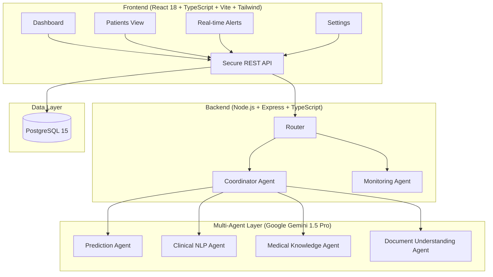
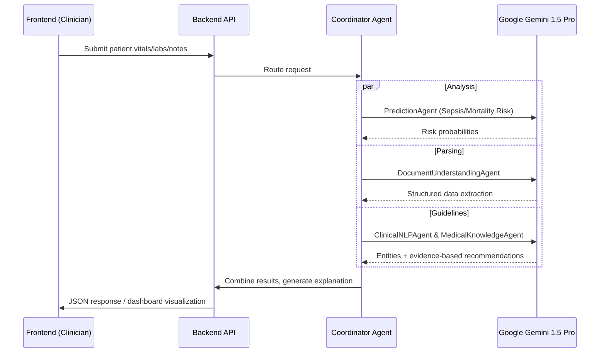
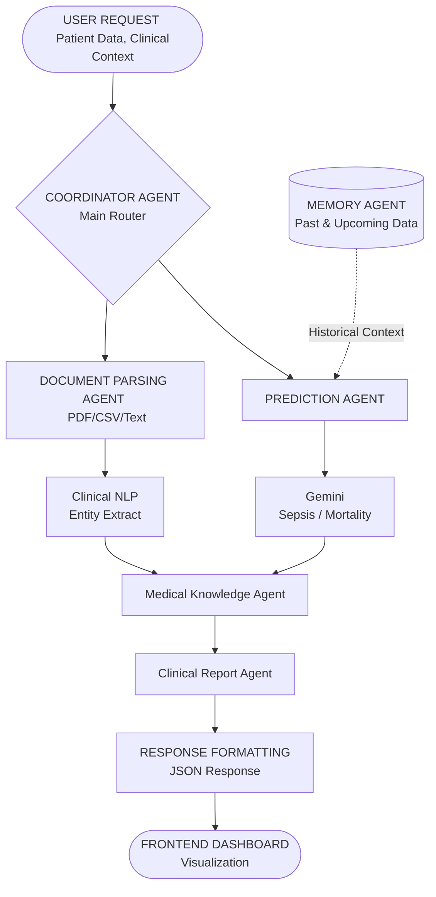

# PraOjas AI: A Multi-Agent Clinical Decision Support System for ICU Care

### A Coordinator agent orchestrating five specialist agents to deliver real-time, explainable sepsis and mortality risk prediction for ICU clinicians.

---

##  Title
**PraOjas AI: A Multi-Agent Clinical Decision Support System for ICU Care**

## Subtitle
An explainable, multi-agent clinical intelligence system that predicts sepsis and mortality risk from ICU vitals, labs, and clinical notes in real time — powered by Google Gemini 1.5 Pro.

**PraOjas** is a portmanteau with deep clinical significance:
- **Pra** → Before, Forward, Proactive, Predictive — emphasizing the system's ability to predict patient trajectories **before** critical events occur.
- **Ojas** → Vitality, Life Force (from Ayurveda) — symbolizing the system's mission to preserve and enhance patient wellbeing by maintaining vital stability.

**Combined Interpretation:** "Proactive Understanding of Patient Vitality Before Deterioration" — PraOjas AI anticipates patient crises, safeguarding the life force of ICU patients through early, evidence-based clinical intelligence.

## Track
**Agents for Good** — built during the Kaggle AI Agents Intensive as a capstone applying multi-agent architecture to a high-stakes healthcare problem.

## Problem Statement

ICU clinicians are responsible for continuously interpreting vitals, labs, and clinical notes across every patient under their care — often while managing several critical patients at once. Three specific pain points drive the need for automated support:

- **Sepsis is time-critical.** Early detection can reduce mortality by 10–40% if diagnosed within the first hour, but sepsis onset is gradual and easy to miss under continuous information overload.
- **Existing risk scores are static and opaque.** Traditional scoring systems (SIRS, qSOFA) produce a number without personalized context or a clear explanation of *why* a patient is trending toward risk.
- **Manual document review doesn't scale.** Clinical notes, labs, and vitals arrive in different formats (PDFs, CSVs, free text), and manually cross-referencing them against evidence-based criteria is time-consuming and error-prone.

**Who faces this problem?** ICU physicians and nurses, particularly in high-occupancy or resource-constrained wards. **Why it matters:** the cost of a missed or delayed sepsis signal is measured in preventable deaths and extended ICU stays.

##  Why AI Agents?

A single chatbot or one-shot LLM prompt can't do this job well because the problem naturally splits into distinct, independently verifiable sub-tasks:

- **Prediction and language understanding are different jobs.** Estimating a sepsis/mortality probability from structured vitals and labs is a different reasoning task from extracting diagnoses, medications, and clinical history from free-text notes.
- **Clinical reasoning needs grounding.** A dedicated Medical Knowledge Agent cross-referencing Sepsis-3 and SIRS criteria reduces the risk of a general-purpose model inventing plausible-sounding but unvalidated medical claims.
- **Continuous monitoring isn't a conversation.** ICU risk assessment is an ongoing pipeline (ingest → parse → predict → explain → alert), not a single question-and-answer exchange, and needs autonomous agents to run independently.
- **Explainability requires composition.** Producing a feature-importance breakdown *and* a clinical entity extraction *and* a plain-language report is naturally a multi-step, multi-agent composition problem, not a single model call.

## Solution Overview

PraOjas AI ingests a patient's vitals, labs, and clinical notes, and returns a synthesized, explainable sepsis/mortality risk assessment with recommended actions — live at **praojas-ai.onrender.com**.

**User workflow:**
1. A clinician logs into the dashboard and lands on the **ICU Overview** — active bed count, critical patient count, interventions performed that day, overall AI model accuracy, a 24-hour sepsis-risk trend.

2. The **Patients** view shows the full **ICU Roster** — every patient's live HR/BP/SpO₂ and computed sepsis-risk percentage, filterable by status and department.

3. Opening a patient surfaces a dedicated workspace: live vitals tiles, a 12-hour multi-line trend chart, and tabs for Vitals History, Lab Results, Medications, Clinical Notes, and a Decision Log. A prominent button reads "Initiate AI Risk Analysis."

4. Clicking **"Initiate AI Risk Analysis"** calls `POST /api/predict` followed by `POST /api/explain`, triggering the full agent pipeline described in Section 7 and returning a sepsis probability, mortality probability, and a structured explanation.
5. The clinician reviews the explanation — not just a score — and takes action (order labs, adjust meds, alert the team) directly from the patient workspace.

## Architecture

### System Architecture

### Request Flow

## Multi-Agent Workflow

### Agent Orchestration

### Agent Responsibilities

| Agent | Role | Key Functions |
|---|---|---|
| **CoordinatorAgent** | Main orchestrator | Routes requests, manages retries and error handling, combines specialist outputs into one response |
| **PredictionAgent** | Risk calculation | Sepsis and mortality probability via Gemini 1.5 Pro |
| **ClinicalNLPAgent** | Text understanding | Extracts diagnoses, medications, and symptoms from clinical notes |
| **MedicalKnowledgeAgent** | Clinical reasoning | Cross-references Sepsis-3 and SIRS criteria, suggests relevant vitals to track |
| **DocumentUnderstandingAgent** | Document parsing | Extracts structured patient data from PDFs, CSVs, and plain text |
| **MonitoringAgent** | Autonomous alerts | Continuous vitals monitoring with threshold-based notifications |

**Communication:** The backend exposes an **active MCP (Model Context Protocol) server**, giving every agent a standardized tool-calling interface. The Coordinator Agent is the single entry/exit point for all requests, ensuring coherent composition and error recovery.

## Key AI Concepts Demonstrated

- **Multi-Agent System (ADK):** One Coordinator orchestrating five specialist agents (Prediction, ClinicalNLP, MedicalKnowledge, DocumentUnderstanding, Monitoring), each independently testable via Vitest and composable via the MCP server.
- **MCP Server:** Standardized Model Context Protocol server for tool-calling, decoupling agent implementation from orchestration logic.
- **Antigravity:** *[Note for Zios: state explicitly how Antigravity fit into your build workflow — e.g., agent scaffolding or IDE-assisted development — so this maps directly to the rubric line item.]*
- **Security Features:** Helmet HTTP headers, Express rate limiting (100 req/15 min per IP), simulated JWT auth middleware, environment-variable secret management, CORS restricted to trusted origins, input validation, and privacy-aware logging.
- **Deployability:** Dockerized locally via Docker Compose (Postgres + full stack), with a documented Google Cloud Run deployment path using Cloud SQL for managed Postgres and Cloud Secret Manager for secret rotation.
- **Agent Skills (CLI or others):** Each agent exposes a scoped function interface (`predict`, `explain`, `parseDocument`, `suggestVitals`) callable both via the REST layer and directly in tests (see `/backend/src/agents/` for module exports).

## Technology Stack

| Layer | Technology |
|---|---|
| Frontend | React 18, TypeScript, Vite, Tailwind CSS, Framer Motion, Axios |
| Backend | Node.js 18+, Express.js, TypeScript, Pino (logging), Helmet, express-rate-limit, TSX |
| Optional fallback backend | Python (FastAPI) — `backend/main.py`, mirrored agent structure |
| AI Model | Google Gemini 1.5 Pro via `@google-ai/generativeai` |
| Agent Orchestration | Custom Coordinator + MCP server for tool calling |
| Database | PostgreSQL 15 |
| Containerization | Docker & Docker Compose |
| Cloud Deployment | Google Cloud Run, Google Cloud SQL, Google Cloud Secret Manager |
| Testing | Vitest, @testing-library/react, Supertest |

Language composition (per repo): **TypeScript 87.8%**, **Python 5.8%** (the optional FastAPI fallback backend).

## Implementation Details

**How each agent works:** Every agent is a scoped class/module (`PredictionAgent`, `ClinicalNLPAgent`, etc.) called by the Coordinator, which owns retry logic and error handling so a single agent failure doesn't cascade. Agents return structured JSON; the Coordinator merges them.

**API surface (four core endpoints):**

- `POST /api/predict` — takes patient vitals, labs, and clinical notes, returns `sepsisProbability`, `mortalityProbability`, and a `confidenceScore`.
- `POST /api/explain` — takes a patient plus a prior prediction, returns a natural-language `explanation`, ranked `featureImportance` (e.g., Lactate at 0.85, Heart Rate at 0.65), extracted `nlpEntities`, and guideline-based recommendations.
- `POST /api/smart-vitals` — given a patient's current status and vitals, suggests a plausible next vitals reading (used to drive the live-feeling trend charts in the demo).
- `POST /api/parse-document` — accepts a PDF/CSV/TXT upload and returns structured patient data (name, age, vitals, labs, notes) with validation warnings.

**Prompt design:** Each agent's prompt is scoped to exactly one responsibility — the PredictionAgent only ever reasons about risk probabilities from structured vitals/labs, while the ClinicalNLPAgent only extracts entities and doesn't predict. This prevents hallucination through isolation.

**Combining outputs:** The Coordinator merges the PredictionAgent's probabilities, the ClinicalNLPAgent's entities, and the MedicalKnowledgeAgent's guideline cross-references into the single `/api/explain` response, preserving full lineage and confidence.

## Security

- **HTTP hardening:** Helmet middleware sets standard security headers on every response.
- **Rate limiting:** `express-rate-limit` caps each IP to 100 requests per 15-minute window on `/api/`, mitigating brute-force and basic DDoS patterns.
- **Authentication:** Simulated JWT auth middleware gates protected routes today; the production checklist explicitly calls out replacing this with real JWT validation before go-live.
- **Secret management:** API keys and DB credentials live in `.env` (git-ignored) for local dev; the documented production path moves the Gemini API key and DB credentials into **Google Cloud Secret Manager** with automatic rotation.
- **Input validation:** `POST /api/parse-document` returns explicit `_validationWarnings` on malformed or incomplete extracted data rather than silently failing.
- **Structured, privacy-aware logging:** Pino JSON logging with sensitive fields (e.g., user IDs) masked at the call site.
- **CORS:** Restricted to an explicit `ALLOWED_ORIGINS` allow-list rather than a wildcard.
- **Documented production hardening checklist:** rotate `SECRET_KEY`, enforce database encryption at rest, enable audit logging on all API calls, set up monitoring/alerting (Datadog/Splunk), run `npm audit` on every deployment, enable HTTPS only, use environment-based config (12-factor app).

## Challenges

- **Keeping five agents' outputs coherent under one response schema.** Solved by making the Coordinator the sole point that touches the final response shape — specialist agents return raw structured data, never format strings.
- **Avoiding hallucinated medical claims.** Solved by routing all guideline-based reasoning through a dedicated MedicalKnowledgeAgent grounded in Sepsis-3/SIRS criteria, rather than letting the PredictionAgent free-form.
- **Making explainability real, not decorative.** Solved by requiring `/api/explain` to return quantified `featureImportance` and extracted `nlpEntities` alongside the narrative explanation, so the clinician sees the reasoning, not just the score.
- **Local-dev-to-cloud parity.** Solved by keeping Docker Compose as the single source of truth for local service composition, then mapping each container 1:1 onto Cloud Run + Cloud SQL + Secret Manager.

## Results / Demo

PraOjas AI is live and fully functional at **praojas-ai.onrender.com**:

- **ICU Overview:** 6 active ICU beds, 2 critical patients, 142 AI-assisted interventions in a day, and **94.2% AI model accuracy**, with a live 24-hour sepsis-risk trend.
- **ICU Roster:** 6 patients across Medical, Surgical, Neuro, and Cardiac ICU, each with a computed sepsis-risk percentage ranging from 8% (stable) to 87% (most critical).
- **Sample prediction (from the API, matching the documented `/api/predict` contract):** a 68-year-old male with HR 105, BP 95/60, temp 38.9°C, RR 22, SpO₂ 94%, lactate 3.1, WBC 14.2 returns `sepsisProbability: 0.73, mortalityProbability: 0.52, confidenceScore: 0.89`.
- **Sample explanation (`/api/explain`):** ranks Lactate (0.85) and Heart Rate (0.65) as the top drivers of that sepsis score, extracts "Suspected Sepsis" and "Hypotension" as diagnoses and "Fever"/"Altered mental status" as clinical notes.
- **Governance surface:** a Settings panel exposing HIPAA/GDPR compliance status, two-factor authentication, and audit-log export, reflecting the production security checklist above rather than a demo stub.

## Impact

- **Time saved:** Consolidates vitals, labs, and note review into one dashboard with a one-click "Initiate AI Risk Analysis" action, instead of manual cross-referencing across systems.
- **Cost reduction:** Earlier sepsis detection (10–40% mortality reduction when caught in the first hour) reduces downstream ICU costs associated with late-stage intervention.
- **Productivity improvement:** Frees clinicians from continuous manual trend-watching by surfacing a ranked risk view (Stable/Warning/Critical) across the whole roster.
- **Who benefits:** ICU physicians and nurses directly; patients indirectly through earlier detection; hospital administrators through better triage during high-occupancy periods.

## Future Improvements

Per the project's own roadmap:

- **FHIR compliance** — integrate with EHR systems via HL7 FHIR APIs; multi-hospital deployment for hospital networks.
- **Federated learning** — collaborative model improvement without sharing patient data across institutions.
- **Outcome prediction** — length-of-stay and discharge-readiness forecasting.
- **Third-party alerting integrations** — Slack, Microsoft Teams, PagerDuty.
- **Enterprise hardening** — multi-tenancy, OAuth2/SSO/SAML, formal HIPAA/GDPR/SOC2 certification (beyond the current "ready" posture).

##  Conclusion

PraOjas AI demonstrates that a Coordinator-plus-specialist-agent architecture — rather than a single generalist model call — is the right fit for ICU risk prediction: it keeps prediction, language understanding, and clinical reasoning separate, each grounded in domain expertise, orchestrated coherently, and transparent to the clinician.

##  GitHub Repository

[PraOjas AI Agent — GitHub Repository](https://github.com/shashidhar-02/PraOjas-AI-Agent)

README includes: full feature list, environment variable setup (`GEMINI_API_KEY`, DB config, JWT secret), `npm install` / `docker-compose up` instructions, complete API reference with request/response examples.

##  Live Demo / Project Link

**Live application:** [praojas-ai.onrender.com](https://praojas-ai.onrender.com)

**Local demo:** `npm install && npm run dev` → frontend at `http://localhost:5173`, backend at `http://localhost:3000`.

## YouTube Video (≤5 minutes)

*[Insert link once recorded.]* Suggested structure:
- 0:00–0:45 — Problem: sepsis detection under ICU information overload
- 0:45–1:30 — Solution walkthrough: dashboard → roster → patient workspace
- 1:30–2:30 — Architecture: Coordinator + 5 agents + MCP server (use the diagrams in Section 7)
- 2:30–4:00 — Live demo: run `/api/predict` → `/api/explain` on a sample patient, show the feature-importance breakdown
- 4:00–4:40 — Tech stack + security/deployability (Docker Compose → Cloud Run)
- 4:40–5:00 — Close: impact + roadmap

##  Media Gallery

- [x] **Cover image** — [landing page hero](https://drive.google.com/file/d/1mU1Ao-JxNlLuT_OwqN2U8PBuFVU52pzF/view?usp=sharing): "Predicting Critical Trajectories Before They Happen."

- [x] **UI screenshots:**
  - [ICU Overview dashboard](https://drive.google.com/file/d/1g_VdqaflV8sGSY54EVayFlig_1s3MUHg/view?usp=sharing)
  - [ICU Roster / Patient Registry](https://drive.google.com/file/d/1mnTGstUANcbUH3G-vp7DPlYaPYz5_-RP/view?usp=sharing)
  - [Individual patient workspace](https://drive.google.com/file/d/1_0xdNFiWGp1TA_2PV8QzlNRhuPjEaVoy/view?usp=sharing)
  - [Settings & Preferences](https://drive.google.com/file/d/1rZw31A9F-4NFu_Xptp-ufi-7JTnwwdc8/view?usp=sharing)

---
